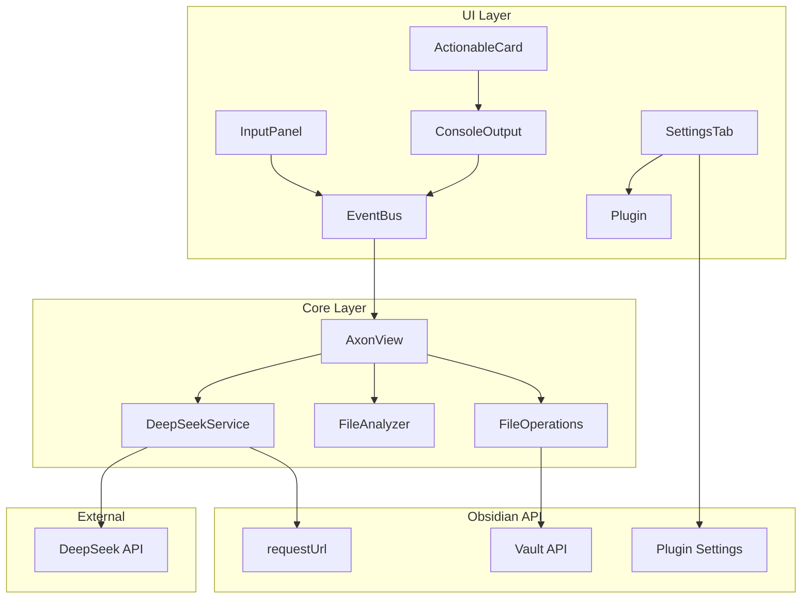

# Design Document: Axon DeepSeek Integration (Phase 3)

## Overview

本设计文档描述了 Axon 插件第三阶段"激活大脑皮层"的技术实现方案。该功能将 Axon 升级为真正的 AI Agent，通过集成 DeepSeek API 实现智能对话，并提供文件操作能力。

核心设计原则：
- 使用 Obsidian 原生 API (requestUrl) 进行网络请求
- 安全存储 API 密钥
- 模块化的 AI 服务架构
- 响应式的 UI 反馈

## Architecture



## Components and Interfaces

### 1. AxonSettings (新增)

插件设置数据结构。

```typescript
interface AxonSettings {
  apiKey: string;
  modelName: string;
}

const DEFAULT_SETTINGS: AxonSettings = {
  apiKey: '',
  modelName: 'deepseek-chat'
};
```

### 2. AxonSettingsTab (新增)

Obsidian 设置页面组件。

```typescript
class AxonSettingsTab extends PluginSettingTab {
  plugin: AxonPlugin;
  display(): void;
  hide(): void;
}
```

### 3. DeepSeekService (新增)

AI API 服务封装。

```typescript
interface DeepSeekService {
  chat(userMessage: string, context?: string): Promise<string>;
  isConfigured(): boolean;
}

interface ChatMessage {
  role: 'system' | 'user' | 'assistant';
  content: string;
}

interface ChatRequest {
  model: string;
  messages: ChatMessage[];
  stream: boolean;
}
```

### 4. FileOperations (新增)

文件操作服务。

```typescript
interface FileOperations {
  appendToCurrentFile(content: string): Promise<void>;
  createChatNote(conversation: ConversationData): Promise<TFile>;
}
```

### 5. ActionableCard (新增 UI 组件)

带操作按钮的 AI 响应卡片。

```typescript
interface ActionableCardData {
  content: string;
  timestamp: Date;
  userMessage: string;
}
```

## Data Models

### ChatMessage

```typescript
interface ChatMessage {
  role: 'system' | 'user' | 'assistant';
  content: string;
}
```

### DeepSeekResponse

```typescript
interface DeepSeekResponse {
  id: string;
  object: string;
  created: number;
  model: string;
  choices: {
    index: number;
    message: {
      role: string;
      content: string;
    };
    finish_reason: string;
  }[];
  usage: {
    prompt_tokens: number;
    completion_tokens: number;
    total_tokens: number;
  };
}
```

### ConversationData

```typescript
interface ConversationData {
  userMessage: string;
  aiResponse: string;
  context?: string;
  timestamp: Date;
}
```


## Correctness Properties

*A property is a characteristic or behavior that should hold true across all valid executions of a system-essentially, a formal statement about what the system should do. Properties serve as the bridge between human-readable specifications and machine-verifiable correctness guarantees.*

### Property 1: API Key Masking

*For any* API key string, the masking function should return a string where all characters except the last 4 are replaced with asterisks, preserving the original length.

**Validates: Requirements 1.2**

### Property 2: Settings Round-Trip Persistence

*For any* valid settings object (apiKey, modelName), saving and then loading should return an equivalent settings object.

**Validates: Requirements 1.3, 1.4**

### Property 3: Request Construction Completeness

*For any* user message and optional file context, the constructed API request should:
- Target the correct endpoint URL
- Include the system prompt
- Include the user message with context (if provided)
- Use the configured model name

**Validates: Requirements 2.1, 2.2, 2.3**

### Property 4: Context Injection Format

*For any* file content and user question, the combined message should contain both the context prefix, the file content, and the user question in the specified format.

**Validates: Requirements 2.3**

### Property 5: Actionable Card Rendering

*For any* AI response content, the rendered Actionable Card should contain the response text and both action buttons (Append, Save Note).

**Validates: Requirements 3.1**

### Property 6: File Append Operation

*For any* content string and target file, appending should result in the file containing the original content plus the new content.

**Validates: Requirements 3.2**

### Property 7: Chat Note Creation

*For any* conversation data, creating a chat note should produce a file with name matching pattern "Axon-Chat-[timestamp].md" containing the conversation.

**Validates: Requirements 3.3**

### Property 8: Loading State Toggle

*For any* loading state transition (start/end), the UI controls should be disabled during loading and re-enabled after completion.

**Validates: Requirements 4.1, 4.2, 4.3**

### Property 9: Error Message User-Friendliness

*For any* API error, the displayed error message should not contain raw exception details and should be in user-friendly language.

**Validates: Requirements 4.4**

### Property 10: Markdown Rendering

*For any* markdown content with formatting (bold, italic, code), the rendered HTML should contain the appropriate HTML tags.

**Validates: Requirements 5.1, 5.2**

## Error Handling

### Error Categories

1. **No API Key**: Display "请先在设置中配置 DeepSeek API Key"
2. **API Error**: Display "AI 服务暂时不可用，请稍后重试"
3. **Network Error**: Display "网络连接失败，请检查网络"
4. **No Active File (Append)**: Display "请先打开一个笔记文件"
5. **File Write Error**: Display "文件写入失败，请重试"

## Testing Strategy

### Property-Based Testing Framework

使用 **fast-check** 作为属性测试库。

### Unit Tests

- DeepSeekService 请求构造测试
- FileOperations 文件操作测试
- Settings 持久化测试
- Markdown 渲染测试

### Property-Based Tests

每个正确性属性对应一个属性测试，运行最少 100 次迭代。

测试注释格式: `**Feature: axon-deepseek, Property {number}: {property_text}**`
