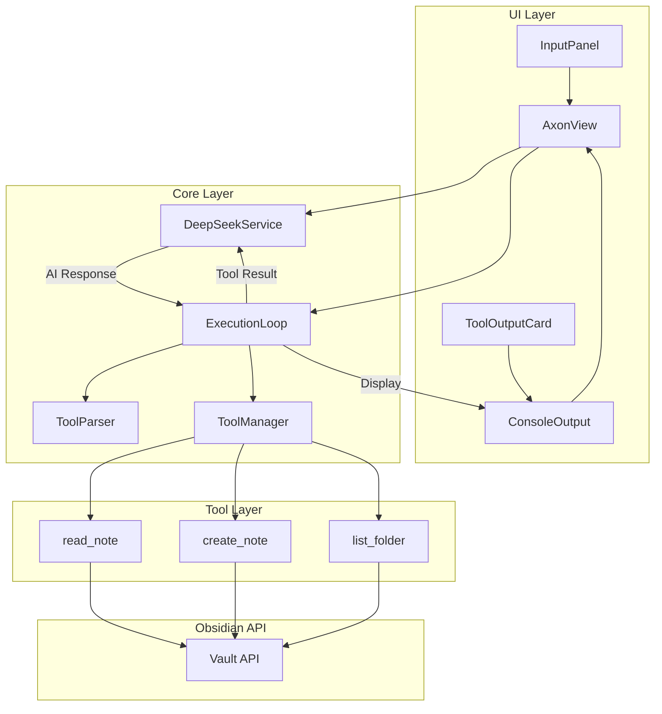

# Design Document: Axon MCP (Model Context Protocol)

## Overview

Axon MCP 功能将 Axon 从被动的问答助手升级为主动的智能代理。通过实现工具使用机制，DeepSeek AI 能够自主执行文件操作，包括读取、创建、修改笔记以及探索 Vault 目录结构。

核心设计理念：
- **最小侵入**: 在现有架构基础上扩展，不破坏已有功能
- **安全优先**: 所有操作限制在 Vault 范围内，防止越权访问
- **用户可见**: 所有工具执行都有明确的 UI 反馈

## Architecture



### 数据流

1. 用户输入消息 → DeepSeekService 发送请求
2. AI 返回响应（可能包含工具调用）
3. ExecutionLoop 解析响应，检测 json:tool 块
4. 如有工具调用 → ToolManager 执行 → 结果反馈给 AI
5. 循环直到 AI 返回纯文本响应
6. 最终结果显示在 ConsoleOutput

## Components and Interfaces

### 1. ToolManager (src/core/tool-manager.ts)

```typescript
interface ToolDefinition {
  name: string;
  description: string;
  parameters: JSONSchema;
}

interface ToolResult {
  success: boolean;
  data?: string;
  error?: string;
}

interface ToolCall {
  tool: string;
  params: Record<string, unknown>;
}

class ToolManager {
  private app: App;
  
  constructor(app: App);
  
  // 获取所有工具定义（用于 System Prompt）
  getToolDefinitions(): ToolDefinition[];
  
  // 执行工具调用
  execute(toolCall: ToolCall): Promise<ToolResult>;
  
  // 具体工具实现
  private readNote(path: string): Promise<ToolResult>;
  private createNote(path: string, content: string, mode?: 'overwrite' | 'append'): Promise<ToolResult>;
  private listFolder(path: string): Promise<ToolResult>;
  
  // 路径处理
  private normalizePath(path: string): string;
  private fuzzyMatchPath(path: string): string | null;
}
```

### 2. ToolParser (src/core/tool-parser.ts)

```typescript
interface ParsedResponse {
  textContent: string;
  toolCalls: ToolCall[];
  hasToolCalls: boolean;
}

class ToolParser {
  // 解析 AI 响应，提取文本和工具调用
  parse(response: string): ParsedResponse;
  
  // 验证工具调用参数
  validateToolCall(toolCall: ToolCall, schema: JSONSchema): boolean;
  
  // 提取 json:tool 代码块
  private extractToolBlocks(response: string): string[];
}
```

### 3. ExecutionLoop (src/core/execution-loop.ts)

```typescript
interface ExecutionContext {
  originalMessage: string;
  conversationHistory: ChatMessage[];
  maxIterations: number;
}

interface LoopResult {
  finalResponse: string;
  toolExecutions: ToolExecution[];
}

interface ToolExecution {
  toolCall: ToolCall;
  result: ToolResult;
  timestamp: Date;
}

class ExecutionLoop {
  private toolManager: ToolManager;
  private toolParser: ToolParser;
  private deepSeekService: DeepSeekService;
  
  constructor(
    toolManager: ToolManager,
    toolParser: ToolParser,
    deepSeekService: DeepSeekService
  );
  
  // 执行完整的对话循环
  run(context: ExecutionContext): Promise<LoopResult>;
  
  // 单次迭代
  private iterate(messages: ChatMessage[]): Promise<{
    response: string;
    toolCalls: ToolCall[];
    shouldContinue: boolean;
  }>;
}
```

### 4. ToolOutputCard (src/ui/tool-output-card.ts)

```typescript
interface ToolOutputData {
  toolName: string;
  params: Record<string, unknown>;
  result: ToolResult;
  timestamp: Date;
}

class ToolOutputCard {
  render(container: HTMLElement, data: ToolOutputData): void;
  setLoading(loading: boolean): void;
}
```

### 5. Updated DeepSeekService

```typescript
// 新增方法
class DeepSeekService {
  // 构建包含工具定义的 System Prompt
  buildAgentSystemPrompt(toolDefinitions: ToolDefinition[]): string;
  
  // 支持多轮对话的聊天方法
  chatWithHistory(messages: ChatMessage[]): Promise<string>;
}
```

## Data Models

### Tool JSON Schema Definitions

```typescript
// read_note 工具参数
interface ReadNoteParams {
  path: string;  // 文件路径，相对于 Vault 根目录
}

// create_note 工具参数
interface CreateNoteParams {
  path: string;           // 文件路径
  content: string;        // 文件内容
  mode?: 'overwrite' | 'append';  // 写入模式，默认 overwrite
}

// list_folder 工具参数
interface ListFolderParams {
  path: string;  // 文件夹路径，空字符串或 "/" 表示根目录
}
```

### Tool Call Format

```json
{
  "tool": "read_note",
  "params": {
    "path": "Daily/2025-01-15.md"
  }
}
```

### Tool Result Format

```typescript
// 成功结果
{
  success: true,
  data: "文件内容或操作结果描述"
}

// 失败结果
{
  success: false,
  error: "错误描述信息"
}
```


## Correctness Properties

*A property is a characteristic or behavior that should hold true across all valid executions of a system-essentially, a formal statement about what the system should do. Properties serve as the bridge between human-readable specifications and machine-verifiable correctness guarantees.*

### Property 1: Read note round-trip
*For any* valid file path and content, if a note is created with that content, then reading the note with read_note should return the exact same content.
**Validates: Requirements 1.1**

### Property 2: Path normalization adds .md extension
*For any* file path string that does not end with `.md`, the normalized path should end with `.md` appended to the original path.
**Validates: Requirements 1.2**

### Property 3: Non-existent file returns error
*For any* file path that does not exist in the Vault, calling read_note should return a ToolResult with success=false and an error message containing "not found".
**Validates: Requirements 1.4**

### Property 4: Create note round-trip
*For any* valid file path and non-empty content string, calling create_note and then reading the file should return the exact content that was written.
**Validates: Requirements 2.1**

### Property 5: Write mode behavior
*For any* existing file with initial content, calling create_note with mode="overwrite" should result in only the new content, while mode="append" should result in initial content followed by new content.
**Validates: Requirements 2.2, 2.3**

### Property 6: Nested folder auto-creation
*For any* file path containing non-existent parent folders, calling create_note should succeed and all parent folders should exist after the operation.
**Validates: Requirements 2.4**

### Property 7: Invalid path returns error
*For any* file path containing invalid characters (e.g., `<`, `>`, `:`, `"`, `|`, `?`, `*`), calling create_note should return a ToolResult with success=false.
**Validates: Requirements 2.5**

### Property 8: List folder returns all contents
*For any* folder containing a known set of files and subfolders, calling list_folder should return a list containing all items in that folder.
**Validates: Requirements 3.1**

### Property 9: Non-existent folder returns error
*For any* folder path that does not exist in the Vault, calling list_folder should return a ToolResult with success=false and an error message.
**Validates: Requirements 3.3**

### Property 10: List folder includes type indicators
*For any* folder containing both files and subfolders, the list_folder result should correctly identify each item's type (file vs folder).
**Validates: Requirements 3.4**

### Property 11: Parameter validation rejects invalid params
*For any* tool call with missing required parameters or wrong parameter types, the ToolManager should return a validation error before attempting execution.
**Validates: Requirements 4.5**

### Property 12: Tool block parsing extracts correct data
*For any* valid JSON string wrapped in \`\`\`json:tool markers containing "tool" and "params" fields, the ToolParser should extract the exact tool name and parameters.
**Validates: Requirements 5.1**

### Property 13: Multiple tool calls execute in order
*For any* AI response containing multiple json:tool blocks, the ExecutionLoop should execute them in the order they appear in the response.
**Validates: Requirements 5.5**

### Property 14: Malformed JSON handled gracefully
*For any* string wrapped in \`\`\`json:tool markers that is not valid JSON, the ToolParser should return an error result without throwing an exception.
**Validates: Requirements 7.1**

### Property 15: Undefined tool returns error
*For any* tool call with a tool name not in the defined tool set, the ToolManager should return a ToolResult with success=false and an error indicating the tool is not found.
**Validates: Requirements 7.2**

### Property 16: Mixed response text extraction
*For any* AI response containing both plain text and json:tool blocks, the ToolParser should correctly separate text content from tool calls, preserving the text that appears before and between tool blocks.
**Validates: Requirements 7.5**

## Error Handling

### ToolManager Errors

| Error Type | Condition | Response |
|------------|-----------|----------|
| FileNotFound | read_note on non-existent path | `{ success: false, error: "File not found: {path}" }` |
| FolderNotFound | list_folder on non-existent path | `{ success: false, error: "Folder not found: {path}" }` |
| InvalidPath | Path contains illegal characters | `{ success: false, error: "Invalid path: {details}" }` |
| WriteError | File system write failure | `{ success: false, error: "Failed to write file: {details}" }` |

### ToolParser Errors

| Error Type | Condition | Response |
|------------|-----------|----------|
| MalformedJSON | Invalid JSON in tool block | `{ success: false, error: "Invalid JSON: {parse error}" }` |
| MissingField | Missing "tool" or "params" field | `{ success: false, error: "Missing required field: {field}" }` |
| InvalidParams | Params don't match schema | `{ success: false, error: "Invalid parameters: {details}" }` |

### ExecutionLoop Errors

| Error Type | Condition | Response |
|------------|-----------|----------|
| UndefinedTool | Tool name not in registry | Feed error back to AI: "Tool '{name}' is not available" |
| MaxIterations | Loop exceeds 10 iterations | Stop loop, display warning to user |
| APIError | DeepSeek API failure | Display error, allow retry |

## Testing Strategy

### Property-Based Testing Framework

使用 **fast-check** 作为 TypeScript 的属性测试库。

### Unit Tests

1. **ToolManager Unit Tests**
   - Test each tool function with valid inputs
   - Test error conditions (file not found, invalid path)
   - Test path normalization logic

2. **ToolParser Unit Tests**
   - Test parsing valid tool blocks
   - Test handling malformed JSON
   - Test mixed content extraction

3. **ExecutionLoop Unit Tests**
   - Test single tool execution
   - Test multiple tool execution order
   - Test max iteration limit

### Property-Based Tests

每个 Correctness Property 对应一个属性测试：

1. **Property 1-4**: 文件操作 round-trip 测试
   - Generator: 随机生成有效路径和内容
   - Property: 写入后读取应返回相同内容

2. **Property 5**: 写入模式测试
   - Generator: 随机生成初始内容和追加内容
   - Property: overwrite 替换，append 拼接

3. **Property 11-16**: 解析器测试
   - Generator: 随机生成有效/无效 JSON 和工具调用
   - Property: 解析结果符合预期

### Integration Tests

1. 完整对话流程测试（模拟 AI 响应）
2. 多工具调用序列测试
3. 错误恢复测试

### Test File Structure

```
tests/
├── tool-manager.test.ts      # ToolManager 单元测试
├── tool-parser.test.ts       # ToolParser 单元测试
├── execution-loop.test.ts    # ExecutionLoop 单元测试
├── tool-manager.property.ts  # ToolManager 属性测试
├── tool-parser.property.ts   # ToolParser 属性测试
└── mcp-integration.test.ts   # 集成测试
```

### Test Configuration

```typescript
// vitest.config.ts 更新
export default defineConfig({
  test: {
    // 属性测试配置
    testTimeout: 30000,  // 属性测试可能需要更长时间
  }
});
```

### Property Test Annotation Format

每个属性测试必须包含注释引用设计文档中的属性：

```typescript
/**
 * **Feature: axon-mcp, Property 1: Read note round-trip**
 * **Validates: Requirements 1.1**
 */
test.prop([validPathArb, contentArb])('read_note returns written content', ...);
```
