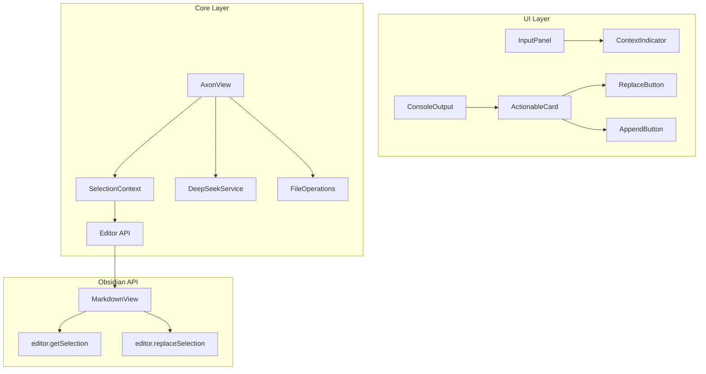

# Design Document: Axon Precision (Phase 4)

## Overview

本设计文档描述了 Axon 插件第四阶段"手术刀般的精准度"的技术实现方案。该功能让 Axon 具备选区感知能力，能够根据用户是否选中文本来动态改变行为。

核心设计原则：
- 使用 Obsidian Editor API 进行选区检测和替换
- 实时监听选区变化
- 安全的替换操作机制
- 清晰的 UI 状态反馈

## Architecture



## Components and Interfaces

### 1. SelectionContext (新增)

管理选区状态和上下文模式。

```typescript
interface SelectionContext {
  mode: 'selection' | 'fullNote' | 'noFile';
  selectedText: string | null;
  originalSelection: string | null;  // 用于验证替换安全性
  hasValidSelection(): boolean;
  getContextForAI(): string | undefined;
  canReplace(): boolean;
}
```

### 2. ContextIndicator (新增 UI 组件)

显示当前上下文模式的指示器。

```typescript
interface ContextIndicatorProps {
  mode: 'selection' | 'fullNote' | 'noFile';
  selectionLength?: number;
}
```

### 3. 扩展 ActionableCard

根据上下文模式显示不同的操作按钮。

```typescript
interface ActionableCardProps {
  // 现有属性...
  contextMode: 'selection' | 'fullNote';
  onReplace?: () => void;  // 仅在 selection 模式下可用
}
```

### 4. 扩展 FileOperations

添加选区替换功能。

```typescript
interface FileOperations {
  // 现有方法...
  replaceSelection(content: string, originalSelection: string): Promise<void>;
  getCurrentSelection(): string | null;
  hasSelection(): boolean;
}
```

## Data Models

### SelectionState

```typescript
interface SelectionState {
  mode: 'selection' | 'fullNote' | 'noFile';
  selectedText: string | null;
  selectionStart: number;
  selectionEnd: number;
  timestamp: number;
}
```

### ConversationData (扩展)

```typescript
interface ConversationData {
  // 现有字段...
  contextMode: 'selection' | 'fullNote';
  originalSelection?: string;  // 用于替换验证
}
```


## Correctness Properties

*A property is a characteristic or behavior that should hold true across all valid executions of a system-essentially, a formal statement about what the system should do. Properties serve as the bridge between human-readable specifications and machine-verifiable correctness guarantees.*

### Property 1: Mode Detection

*For any* selection state, the system should correctly determine the context mode:
- Non-empty selection → Selection Mode
- Empty selection or cursor only → Full Note Mode
- No active file → No File Mode

**Validates: Requirements 1.1, 1.2**

### Property 2: Context Indicator Rendering

*For any* context mode, the indicator should display the correct text:
- Selection Mode → "🔍 Focused on Selection"
- Full Note Mode → "📄 Full Note Context"
- No File Mode → "⚠️ No file open"

**Validates: Requirements 1.3, 1.4, 5.3**

### Property 3: Selection Context Format

*For any* selected text and user instruction, the formatted context in Selection Mode should match: "Selected Text:\n\n${selection}\n\nUser Instruction: ${userInput}"

**Validates: Requirements 2.1, 2.2**

### Property 4: Button Rendering Based on Mode

*For any* AI response:
- In Selection Mode: "Replace Selection" and "Append" buttons should be present
- In Full Note Mode: "Append" and "Save Note" buttons should be present, no "Replace Selection"

**Validates: Requirements 3.1, 3.2, 3.3**

### Property 5: Selection Validation for Replace

*For any* replace operation, the system should verify that the current selection matches the original selection stored when the request was made. If they don't match, the operation should fail with an error.

**Validates: Requirements 4.1, 4.4**

### Property 6: Replace Operation Success

*For any* valid replace operation (matching selection), the editor content should be updated with the AI response replacing the selected text.

**Validates: Requirements 3.4, 4.3**

## Error Handling

### Error Categories

1. **Selection Lost**: Display "选区已丢失，无法替换"
2. **No Active Editor**: Display "请先打开一个笔记文件"
3. **Selection Changed**: Display "选区内容已更改，无法替换"
4. **Replace Failed**: Display "替换失败，请重试"

## Testing Strategy

### Property-Based Testing Framework

使用 **fast-check** 作为属性测试库。

### Unit Tests

- SelectionContext 模式检测测试
- Context 格式化测试
- 按钮渲染逻辑测试

### Property-Based Tests

每个正确性属性对应一个属性测试，运行最少 100 次迭代。

测试注释格式: `**Feature: axon-precision, Property {number}: {property_text}**`
