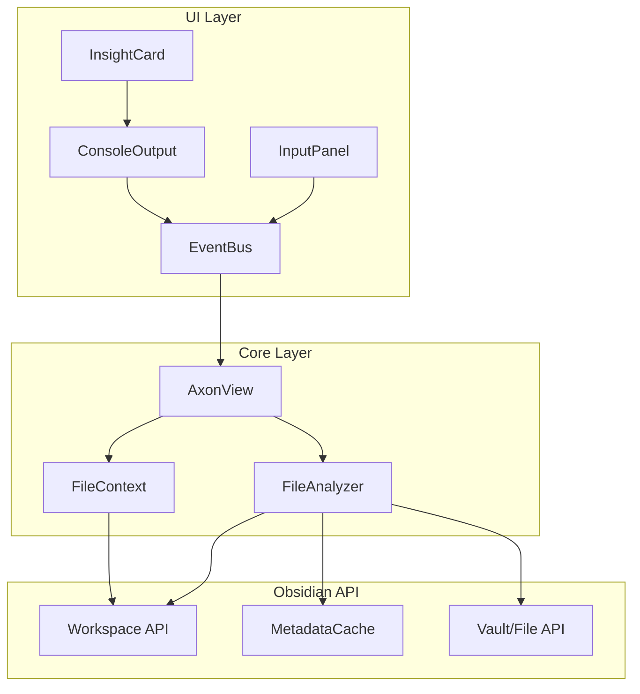

# Design Document: Axon Sensation (Phase 2)

## Overview

本设计文档描述了 Axon 插件第二阶段"触觉"功能的技术实现方案。该功能使 Axon 能够读取、分析当前激活的 Markdown 笔记，并以结构化的方式展示分析结果。

核心设计原则：
- 利用 Obsidian API 进行文件访问和元数据获取
- 模块化的分析器架构，便于扩展
- 响应式的 UI 更新机制
- 优雅的错误处理

## Architecture



## Components and Interfaces

### 1. FileAnalyzer (新增)

负责分析 Markdown 文件内容的核心模块。

```typescript
interface FileAnalyzer {
  analyzeFile(file: TFile): Promise<FileAnalysisResult>;
  extractHeadings(content: string): HeadingInfo[];
  countWords(content: string): number;
  extractLinks(content: string, cache: CachedMetadata): LinkInfo;
  parseFrontmatter(cache: CachedMetadata): FrontmatterData | null;
}
```

### 2. FileContext (新增)

管理当前文件上下文和文件切换检测。

```typescript
interface FileContext {
  currentFile: TFile | null;
  onFileChange(callback: (file: TFile | null) => void): void;
  startWatching(): void;
  stopWatching(): void;
}
```

### 3. InsightCard (新增 UI 组件)

在控制台中展示文件分析结果的卡片组件。

```typescript
interface InsightCardData {
  fileName: string;
  filePath: string;
  wordCount: number;
  headings: HeadingInfo[];
  links: LinkInfo;
  frontmatter: FrontmatterData | null;
  lastModified: string;
}
```

### 4. 扩展现有组件

- **AxonView**: 添加 FileAnalyzer 和 FileContext 实例，处理分析事件
- **ConsoleOutput**: 添加 `addInsightCard()` 方法渲染分析结果
- **InputPanel**: 已有 Analyze 按钮，需确保事件正确触发

## Data Models

### FileAnalysisResult

```typescript
interface FileAnalysisResult {
  file: {
    name: string;
    path: string;
    size: number;
  };
  stats: {
    wordCount: number;
    characterCount: number;
    lineCount: number;
    lastModified: string;
  };
  structure: {
    headings: HeadingInfo[];
    headingCount: number;
  };
  links: {
    internal: string[];
    external: string[];
    internalCount: number;
    externalCount: number;
  };
  frontmatter: FrontmatterData | null;
  analyzedAt: Date;
}
```

### HeadingInfo

```typescript
interface HeadingInfo {
  level: number;      // 1-6
  text: string;
  position: number;   // line number
}
```

### LinkInfo

```typescript
interface LinkInfo {
  internal: string[];   // [[wiki links]]
  external: string[];   // https:// links
  internalCount: number;
  externalCount: number;
}
```

### FrontmatterData

```typescript
interface FrontmatterData {
  title?: string;
  tags?: string[];
  date?: string;
  [key: string]: unknown;
}
```


## Correctness Properties

*A property is a characteristic or behavior that should hold true across all valid executions of a system-essentially, a formal statement about what the system should do. Properties serve as the bridge between human-readable specifications and machine-verifiable correctness guarantees.*

### Property 1: File Retrieval Validation

*For any* active file in the workspace, when the analyze action is triggered, the system should either:
- Successfully retrieve the file content if it's a Markdown file
- Return an appropriate error if the file is not Markdown or no file is active

**Validates: Requirements 1.1, 1.2, 1.3**

### Property 2: Heading Extraction Accuracy

*For any* Markdown content containing headings (H1-H6), the extracted headings array should contain exactly the headings present in the content, with correct hierarchy levels and text.

**Validates: Requirements 2.1**

### Property 3: Word Count Consistency

*For any* text content, the word count function should return a consistent count that equals the number of whitespace-separated tokens in the content (excluding markdown syntax).

**Validates: Requirements 2.2**

### Property 4: Link Extraction Completeness

*For any* Markdown content, the link extraction should:
- Identify all wiki-style links matching the pattern `[[...]]`
- Identify all external URLs matching standard URL patterns
- Return accurate counts for both link types

**Validates: Requirements 2.3, 2.4**

### Property 5: Frontmatter Parsing Round-Trip

*For any* valid YAML frontmatter block, parsing and re-serializing should preserve the key-value pairs. For malformed frontmatter, the parser should return null without throwing errors.

**Validates: Requirements 2.5, 5.2**

### Property 6: Insight Card Data Completeness

*For any* FileAnalysisResult, the rendered Insight Card should contain: file name, word count, heading count, internal link count, and external link count.

**Validates: Requirements 3.1, 3.2**

### Property 7: Frontmatter Display in Card

*For any* FileAnalysisResult with non-null frontmatter containing tags, date, or title fields, the rendered Insight Card should display these metadata fields.

**Validates: Requirements 3.4**

### Property 8: File Context Update on Change

*For any* file change event, the FileContext should:
- Update the currentFile reference to the new file
- Emit a notification event to the console

**Validates: Requirements 4.1, 4.2, 4.3**

### Property 9: Error Handling Graceful Degradation

*For any* error during analysis, the system should display a user-friendly error message (not raw exception) and the console should remain functional.

**Validates: Requirements 5.4**

## Error Handling

### Error Categories

1. **No Active File**: Display "请先打开一个 Markdown 文件" message
2. **Non-Markdown File**: Display "仅支持 Markdown 文件分析" message
3. **Empty File**: Show Insight Card with zero counts and "空文档" indicator
4. **Malformed Frontmatter**: Skip frontmatter, continue analysis, log warning
5. **Analysis Error**: Display generic error message, log details to console

### Error Message Format

```typescript
interface ErrorMessage {
  type: 'error';
  content: string;
  timestamp: Date;
  details?: string;  // for console logging only
}
```

## Testing Strategy

### Property-Based Testing Framework

使用 **fast-check** 作为 JavaScript/TypeScript 的属性测试库。

### Unit Tests

- FileAnalyzer 各方法的基本功能测试
- InsightCard 渲染的快照测试
- EventBus 事件传递测试

### Property-Based Tests

每个正确性属性对应一个属性测试：

1. **Property 1 Test**: 生成随机文件类型，验证系统正确处理 Markdown 和非 Markdown 文件
2. **Property 2 Test**: 生成包含随机标题的 Markdown 内容，验证提取准确性
3. **Property 3 Test**: 生成随机文本，验证字数统计一致性
4. **Property 4 Test**: 生成包含随机链接的 Markdown，验证链接提取完整性
5. **Property 5 Test**: 生成随机 YAML 对象，验证 frontmatter 解析的往返一致性
6. **Property 6 Test**: 生成随机 FileAnalysisResult，验证 Insight Card 包含所有必需字段
7. **Property 7 Test**: 生成包含 frontmatter 的分析结果，验证元数据显示
8. **Property 8 Test**: 模拟文件切换事件，验证上下文更新和通知
9. **Property 9 Test**: 注入各种错误，验证错误消息友好且系统稳定

### Test Configuration

- 每个属性测试运行最少 100 次迭代
- 测试文件使用 `.test.ts` 后缀
- 测试注释格式: `**Feature: axon-sensation, Property {number}: {property_text}**`
