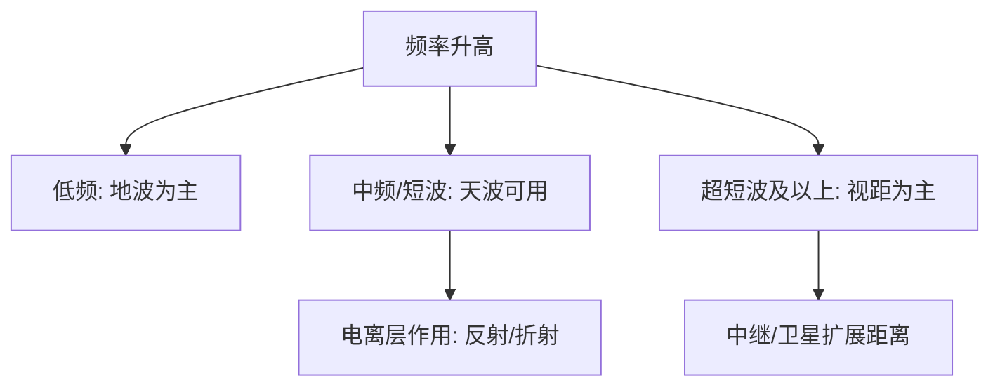

---
tags:
  - 考研
  - 复试
  - 通信电子线路
  - 第1章
created: 2026-01-25
parent: "[[复试相关/通信电子线路/Codex笔记/第1章 通信电子线路概述/第1章 通信电子线路概述]]"
---

# 1.3 无线信道及传播方式

> [!abstract] 本节一句话
> 频率决定传播：低频以地波为主；中频/短波可借助电离层形成天波；进入超短波后主要视距传播，必要时通过中继/卫星扩展距离。

## 一、三种基本传播方式

### 1) [[地波传播]]
- 贴近地表传播
- 频率较低时衰减小、覆盖远

### 2) [[天波传播]]（电离层反射/折射）
- 电波到达电离层后返回地面，实现远距离通信
- 频率太低：电离层吸收大；频率太高：会穿透电离层进入外层空间
- 实际常用于短波（HF）通信

### 3) [[视距传播]]（直线传播）
- 超短波及更高频段：地波衰减大，天波又难以返回
- 受地球曲率影响：天线高度决定视距
- 可用中继/卫星提升覆盖

## 二、无线电频段划分（记“范围 + 特性 + 典型应用”）

> [!important] 一眼记忆法
> - MF/HF：可能出现天波
> - VHF 及以上：多为视距/直线传播（可中继/卫星）

| 频带 | 名称 | 传播方式（典型） | 典型应用（举例） |
|---|---|---|---|
| 3–30 kHz | VLF 甚低频 | 地波 | 远距离导航、声呐、电报 |
| 30–300 kHz | LF 低频 | 地波 | 导航、航标信号 |
| 0.3–3 MHz | MF 中频 | 地波/天波 | AM 广播、遇险呼救 |
| 3–30 MHz | HF 高频（短波） | 天波/地波 | 短波通信、远距离广播 |
| 30–300 MHz | VHF 甚高频（超短波） | 直线传播 | FM 广播、电视、航空通信 |
| 0.3–3 GHz | UHF 特高频 | 直线传播 | 雷达、卫星、移动通信 |
| 3–30 GHz | SHF 超高频 | 直线传播 | 微波接力、卫星、雷达 |

> [!note] 进一步
> 随频段升高，传播更复杂；大气中氧气/水蒸气吸收等效应变得重要。

