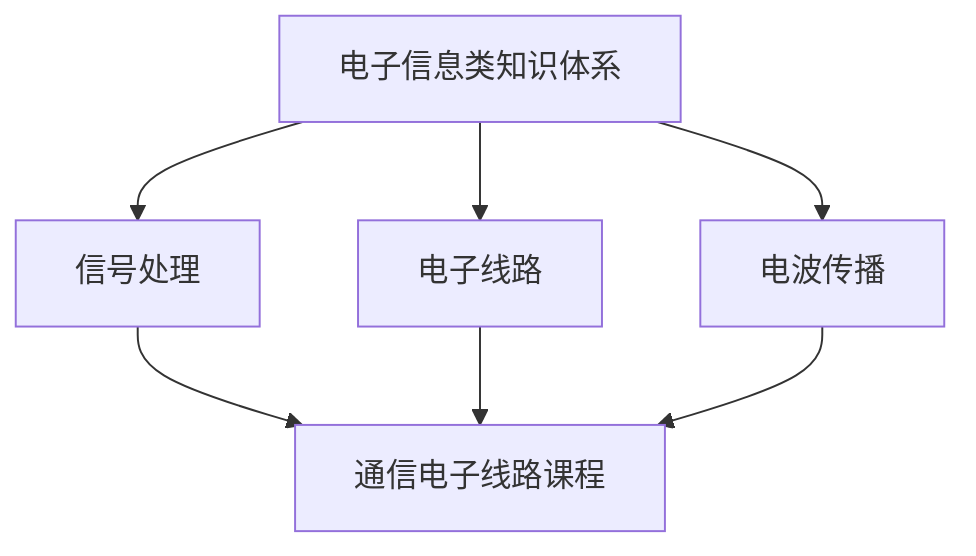

---
tags:
  - 考研
  - 复试
  - 通信电子线路
  - 第1章
aliases:
  - 通信电子线路概述
  - RFC概述
created: 2026-01-25
source: "[[复试相关/通信电子线路/课本资料/通信电子线路]]"
---

# 第1章 通信电子线路概述

> [!goal] 🎯 复习目标
> - 说清 [[复试相关/通信电子线路/Codex笔记/第1章 通信电子线路概述/通信电子线路]]（高频电子线路）的定义与“为什么必须高频”
> - 画出通信系统/收发信机框图，解释每个功能模块
> - 讲清 [[调制]]/[[解调]] 的目的与三种基本方式（AM/FM/PM）
> - 区分地波/天波/视距传播，并能按频段解释“为什么这样传播”

> [!important] 章节入口
> - [[复试相关/通信电子线路/Codex笔记/第1章 通信电子线路概述/1.1 通信电子线路的发展]]
> - [[复试相关/通信电子线路/Codex笔记/第1章 通信电子线路概述/1.2 通信电子线路的研究对象]]
> - [[复试相关/通信电子线路/Codex笔记/第1章 通信电子线路概述/1.3 无线信道及传播方式]]

## 一、核心概念速记

### 1) [[复试相关/通信电子线路/Codex笔记/第1章 通信电子线路概述/通信电子线路]]
> [!abstract] 定义
> 在两地或多地之间进行信息的**发射、接收和处理**的电子线路结构（射频/高频电子线路，RFC）。

> [!note] 关键一句话
> 原始信息要远距离传播，必须先变成可辐射/可传输的**电磁信号**；接收端再还原为原始信息。

### 2) 信号与课程定位
> [!abstract] 信号
> 携带信息的物理过程；数学上可表示为一个或多个自变量的函数。

> [!tip] 三大知识平台（本课程处于“枢纽”位置）
> - 信号处理（频谱/调制等）
> - 电子线路（实现模块）
> - 电波传播（信道）



## 二、必背框图（会画会讲）

### 1) 通信系统基本组成（最小模型）


### 2) 无线电收发信机（复试常问：模块功能）
```mermaid
graph TB
  subgraph tx["发射机（Tx）"]
    m[低频信息 m(t)] --> mod[调制器]
    osc[高频载波振荡器] --> mod
    mod --> pa[功率放大]
    pa --> ant1[发射天线]
  end
  ant1 --> ch[无线信道] --> ant2[接收天线]
  subgraph rx["接收机（Rx）"]
    ant2 --> lna[高频放大/选频]
    lna --> demod[解调器]
    demod --> out[恢复的低频信息]
  end
```

> [!important] 高频通信的两条“硬理由”
> - 天线尺寸：天线长度需要与波长同量级；音频 20 Hz–20 kHz 对应波长太长，天线不可行
> - 多用户/选择性：不同电台用不同载频，接收端才能靠选频“挑台”

## 三、考点清单（按问答准备）

> [!question] 高频/调制/解调
> 1. 为什么无线通信要用高频？（天线尺寸 + 频分复用/选频）
> 2. [[调制]]的定义、目的、三种基本方式（AM/FM/PM）
> 3. [[解调]]的定义：从已调高频信号中恢复基带信息

> [!question] 信道与传播
> 1. 地波/天波/视距传播的定义与频段范围
> 2. 为什么短波可天波（电离层反射），超短波只能视距
> 3. 频段划分（VLF/LF/MF/HF/VHF/UHF/SHF…）与典型应用

> [!example]+ 典型作答模板（30–60 秒）
> “通信系统由发送设备、信道、接收设备三部分组成。发送端把信源信息变为适于传输的信号，经信道到达接收端。无线通信需要把基带信息调制到高频载波上：一方面天线尺寸要与波长同量级，音频波长过长；另一方面不同电台用不同载频便于选频。接收端通过选频放大与解调恢复基带信息。传播上，低频以地波为主，中频/短波可天波，进入超短波后主要视距传播，必要时用中继/卫星扩展距离。”  

## 四、练习题（对照口述）

> [!example]+ 习题（来自课本）
> 1. 画出无线通信收发信机原理框图，并说出各部分功用。
> 2. 无线通信为什么要用高频信号？“高频”指什么？
> 3. 无线通信为什么要调制？如何调制？
> 4. 无线电频段如何划分？传播特性与应用如何？
> 5. 计算机通信“调制/解调”与无线通信异同？
> 6. 说明“功能模块”在系统设计中的作用。

## 五、可视化

- ![[第1章 通信电子线路概述.excalidraw|700]]
- ![[第1章 通信电子线路概述.canvas|700]]
