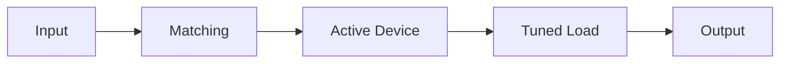

# Chapter 3: 高频小信号放大器

[[../00-overview/00-course-map|<- Back to Course Map]] | [[quick-ref|Quick Ref ->]] | [[practice-problems|Practice ->]]

---

> [!abstract] 本章总览（复试向）
> - 主题：小信号放大指标、晶体管高频模型、单/多/双调谐放大器、稳定性、噪声
> - 考点：通频带与选择性、矩形系数/抑制比、Q 与带宽、耦合状态、噪声系数

> [!tip] 记忆锚点
> - **通频带 = 3 dB 带宽 = 0.7 倍增益处的频宽**
> - **Q 高 -> 带宽窄 -> 选择性好**
> - **欠耦合单峰尖、过耦合双峰、临界耦合带宽最均衡**

## Learning Objectives

> [!note] 你应该能够
> - 解释高频小信号放大器的主要指标：增益、通频带、选择性、稳定性、噪声
> - 写出矩形系数与抑制比的定义
> - 理解晶体管高频等效模型（y 参数与混合 pi）与关键参数
> - 比较单调谐、双调谐、多级放大器的频响与带宽
> - 说明常见稳定措施与噪声抑制手段
> - 使用噪声系数/噪声温度/Friis 公式进行估算

---

## 3.1 概述与质量指标

**高频 vs 低频放大器**
- 低频：频带宽、负载多为电阻或变压器。
- 高频：中心频率高、相对带宽窄，常用选频网络组成谐振放大器。

**主要指标**
1) **增益** $A_u$ 或 $A_p$：单级尽量高，但与带宽存在矛盾。  
2) **通频带** $2\Delta f_{0.7}$：增益降为 $A_{u0}$ 的 $1/\sqrt{2}$ 处。  
3) **选择性**：抑制邻台和干扰信号的能力。  
4) **稳定性**：参数变化下的增益/中心频率稳定性，避免自激。  
5) **噪声系数** $F$：越接近 1 越好，前级最关键。

**选择性指标**
- 矩形系数：

$$
K_{r0.1} = \frac{2\Delta f_{0.1}}{2\Delta f_{0.7}}, \quad K_{r0.01} = \frac{2\Delta f_{0.01}}{2\Delta f_{0.7}} \tag{3.1, 3.2}
$$

- 抑制比：

$$
d = \frac{A_{u0}}{A_u}, \quad d(\mathrm{dB}) = 20\lg d
$$

**频响示意**

---

## 3.2 晶体管高频小信号等效模型

### 3.2.1 y 参数等效电路（形式等效）

$$
\dot{I}_1 = y_i \dot{U}_1 + y_r \dot{U}_2, \quad \dot{I}_2 = y_f \dot{U}_1 + y_o \dot{U}_2 \tag{3.3, 3.4}
$$

- **优点**：通用、便于网络分析。  
- **缺点**：参数随频率变化。

### 3.2.2 混合 pi 等效电路

关键元件：$r_{bb'}$、$C_{bc}$、$g_m$、$r_{ce}$ 等。

**重要结论**
- $C_{bc}$ 引入反馈，易造成自激。
- $g_m$ 近似：

$$
g_m \approx I_c / 26 \tag{3.14}
$$

### 3.2.3 高频参数
- 截止频率 $f_\beta$：$|\beta|$ 下降至 $\beta_0/\sqrt{2}$ 处。

---

## 3.3 单调谐回路谐振放大器

**特征**：谐振回路作为负载，增益与选频兼具。

- 通频带近似：

$$
2\Delta f_{0.7} = \frac{f_0}{Q_L}
$$

- Q 越高 -> 增益高但带宽窄。

---

## 3.4 多级单调谐回路

- 总增益为各级增益乘积。
- 级数增加使总通频带变窄。
- 常用 **交错调谐** 保持所需带宽。

---

## 3.5 双调谐回路放大器

- 两个耦合谐振回路，响应形状由耦合度决定。

| 耦合状态 | 频响特点 | 典型用途 |
|---|---|---|
| 欠耦合 | 单峰尖锐，带宽窄 | 高选择性 |
| 临界耦合 | 带宽较平衡 | 通用 |
| 过耦合 | 双峰响应 | 宽带需求 |

---

## 3.6 稳定性与稳定措施

**不稳定表现**：增益漂移、中心频率偏移、谐振曲线变形、自激。

**常用稳定措施**
- 降低单级增益、加入衰减
- 中和电路减少反馈
- 合理屏蔽与接地
- 级间失配或隔离

---

## 3.7 常用电路与集成放大器

- 常见：共射调谐放大器、变压器耦合放大器等。
- 集成谐振放大器：结构紧凑、参数稳定、便于批量化。

---

## 3.8 场效应管高频小信号放大器

| 比较项 | BJT | FET |
|---|---|---|
| 控制方式 | 电流控制 | 电压控制 |
| 输入阻抗 | 较低 | 高 |
| 噪声 | 相对高 | 较低 |
| 高频性能 | 强 | 强（更低噪） |

- 共源：增益高
- 共栅：输入阻抗低，带宽大
- 共源-共栅级联：抑制 Miller 效应

---

## 3.9 放大器中的噪声

**热噪声**（电阻）：

$$
\overline{v_n^2} = 4kTRB
$$

- $k$ 为玻尔兹曼常数，$T$ 为温度，$B$ 为带宽。

**噪声来源**
- 器件内部噪声、外部天线噪声、环境噪声。

---

## 3.10 噪声表示与计算

- 噪声系数：

$$
F = \frac{\mathrm{SNR}_{in}}{\mathrm{SNR}_{out}}, \quad NF = 10\log_{10} F
$$

- Friis 公式：

$$
F_{total} = F_1 + \frac{F_2-1}{G_1} + \frac{F_3-1}{G_1G_2} + \cdots
$$

> [!tip] 降噪原则
> - 前级低噪声最重要
> - 选择合适偏置点
> - 缩小带宽，减少噪声

---

返回：[[../00-overview/00-course-map|Course Map]] | [[quick-ref|Quick Ref]] | [[practice-problems|Practice]]
